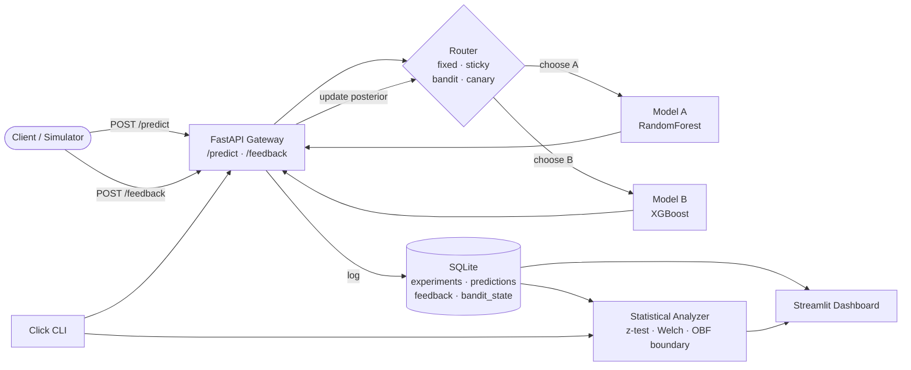

# ML A/B Testing Platform

[](https://github.com/Philopateer-Nabil/ml-ab-platform/actions/workflows/ci.yml)
[](https://www.python.org)
[](LICENSE)
[](https://github.com/astral-sh/ruff)

A production-quality experimentation platform for ML models — written in Python,
runs entirely locally, zero paid services. Trains two classifiers on the UCI
Adult income dataset, then demonstrates how to route, measure, and *statistically*
compare them the way a real ML team would in production.

> **Why experimentation matters in production ML.** Offline metrics are a
> lower bound — they tell you how a model behaves on a *frozen* test set, not
> how it behaves on live traffic where the distribution, the users, and the
> downstream business metrics all differ. The only way to know which model
> is actually better for your users is to run it against live traffic,
> log the outcomes, and analyse the results with the right statistical tools.
> This repo is a small, honest implementation of that loop.

## Architecture



## What's inside

| Module | Purpose |
| --- | --- |
| `models/` | Training pipeline (sklearn Pipelines, swap any classifier in). |
| `api/` | FastAPI gateway: `/predict`, `/feedback`, full experiment CRUD. |
| `routing/` | `Router` base class + four strategies (fixed / sticky / bandit / canary). |
| `bandit/` | Thompson Sampling for Beta-Bernoulli arms with regret tracking. |
| `analysis/` | Two-proportion z-test, Welch's t-test, Cohen's h, O'Brien-Fleming, sample size, power. |
| `experiments/` | `Experiment` data model + SQLite store + lifecycle manager. |
| `simulation/` | Synthetic-traffic driver with four scenarios. |
| `dashboard/` | Streamlit UI with six tabs, all Plotly visualisations. |
| `cli/` | `mlab` Click CLI: train · serve · dashboard · experiment · simulate · analyze. |
| `storage.py` | SQLite schema + per-call connections (WAL mode). |
| `config.py` | Pydantic settings loaded from YAML with env var overrides. |
| `logging_/` | Structlog configuration — one format to grep them all. |

## Setup

```bash
git clone https://github.com/Philopateer-Nabil/ml-ab-platform.git
cd ml-ab-platform
pip install -e ".[dev]"
# or, if you use make:
make install
```

Python 3.10+ is required.

### Docker (alternative)

If you prefer containers, everything runs via the bundled `docker-compose.yml`:

```bash
make docker-build        # build the image
make docker-train        # one-off: train baseline models into the shared volume
make docker-up           # start API (:8000) + dashboard (:8501)
docker compose run --rm simulate    # drive synthetic traffic at the API
make docker-down
```

A persistent named volume (`mlab-data`) holds the SQLite DB and joblib artifacts
across container restarts.

## Quickstart walkthrough

A full end-to-end demo in five commands:

```bash
# 1. Train both models and save offline metrics
mlab train

# 2. Start the gateway in one terminal
mlab serve

# 3. In a second terminal: create an experiment, start it
mlab experiment create --name demo-run --strategy fixed --split 0.5 --min-samples 300
mlab experiment list                       # grab the ID
mlab experiment start <experiment_id>

# 4. Fire synthetic traffic
mlab simulate --scenario clear-winner --requests 2000

# 5. Inspect the result
mlab experiment status <experiment_id>     # terminal report
mlab dashboard                             # rich UI at http://localhost:8501
mlab experiment conclude <experiment_id>   # archive the winner
```

You should see a verdict like:

```
Verdict: SIGNIFICANT
Model B is significantly better (p=0.0001, Δ=7.82pp, Cohen's h=0.214).
```

## Routing strategies

| Strategy | When to use | Tradeoffs |
| --- | --- | --- |
| **Fixed split** | Classic controlled experiment, small / short-lived tests. | Wastes traffic on the losing arm for the whole run. Simple to reason about. |
| **Sticky (hash on user_id)** | Any time the *same user may make multiple requests* — which is almost always. | Same statistical rigour as fixed, without polluting each user's experience across arms. **This is the default for real A/B tests.** |
| **Bandit (Thompson Sampling)** | Continuous optimisation, many parallel experiments, where you care more about regret than sharp p-values. | Traffic skews toward the winner almost immediately — good for revenue, bad for clean significance testing. |
| **Canary** | Risky deployments: new models, infra changes, anything where "better on average" isn't enough and you want downside protection. | Slower to collect data on the new model. Requires a working-definition of "degraded" (we use accuracy within a configurable threshold). |

### Sticky routing: the subtle-but-critical one

If a single user can make many requests and you assign each one independently,
you are *mixing the conditions per user*. Imagine user Alice gets Model A on
requests 1-3, Model B on request 4, A again on 5. Whatever she does next
cannot be cleanly attributed to either model. By hashing `user_id` once and
routing all their traffic to the same arm for the duration of the experiment,
you retain per-user attribution.

### Canary mode

Canary starts at `initial_split` (default 5%) to Model B. After `min_samples`
feedback labels arrive, the canary is either **promoted** (accuracy of B is
within `degradation_threshold` of A → traffic rebalances to `promoted_split`)
or **frozen** (B degraded more than threshold below A → traffic returns 100%
to A, experiment marked degraded).

## Statistical methodology

### Two-proportion z-test (accuracy)

For binary outcomes (correct / incorrect), the headline metric is the
difference in proportions. Standard pooled-variance z-test:

$$
z = \frac{\hat p_B - \hat p_A}{\sqrt{\hat p\,(1-\hat p)\,\left(\frac{1}{n_A} + \frac{1}{n_B}\right)}}, \quad \hat p = \frac{k_A + k_B}{n_A + n_B}
$$

with a confidence interval on the difference using the *unpooled* variance
(standard practice for reported CIs).

### Welch's t-test (latency)

Latency distributions are heavy-tailed and have unequal variance between
models. Welch's t-test tolerates that:

$$
t = \frac{\bar x_B - \bar x_A}{\sqrt{s_A^2/n_A + s_B^2/n_B}}
$$

with Satterthwaite's df approximation.

### Sample size & power

Before an experiment starts, you should know how many samples it needs:

$$
n \approx \frac{\left(z_{\alpha/2}\sqrt{2\bar p(1-\bar p)} + z_\beta\sqrt{p_A(1-p_A)+p_B(1-p_B)}\right)^2}{(p_B - p_A)^2}
$$

The analyzer computes this for you and reports "current power" at the
observed sample size. If power < 80% and p > α, the verdict is
**`not_yet`**, not **`no_difference`** — those are not the same thing.

### Effect size: Cohen's h

A small p-value with a tiny difference is *statistically* significant but
*practically* irrelevant. Cohen's h is the recommended effect size for
proportions:

$$
h = 2\arcsin\sqrt{p_B} - 2\arcsin\sqrt{p_A}
$$

Rough reading: |h| ≈ 0.2 small, 0.5 medium, 0.8 large.

### The peeking problem & sequential testing

**Peeking** is checking your p-value repeatedly during an experiment and
stopping as soon as it crosses 0.05. Doing this inflates the Type-I error
dramatically — with 5 interim looks you can roughly *double* your false
positive rate. Every watchful dashboard is a peeking machine.

We implement the classic **O'Brien-Fleming** alpha-spending boundary:

$$
z_{\text{OF}}(t) = \frac{z_{\alpha/2}}{\sqrt{t}}
$$

where *t* is the information fraction (samples collected / samples needed).
Early looks demand a much larger z to call significance (e.g. at t=0.1 you'd
need |z| > 6.2), so cumulative Type-I error stays ≤ α even with continuous
monitoring. The analyzer reports both the fixed-horizon p-value *and*
whether the sequential boundary has been crossed — only the latter is safe
to act on while the experiment is still running.

## Bandits vs classical A/B tests

| | **Classical A/B (fixed split)** | **Thompson Sampling bandit** |
| --- | --- | --- |
| Goal | Rigorously detect a winner | Minimise regret while learning |
| Loss if A is 10% worse | 50% of traffic for duration | Decays toward 0 quickly |
| Can you report a clean p-value? | Yes | Not really — the sampling distribution is no longer i.i.d. |
| When to use | Launch decisions, model evaluation reports, anything reviewed by stakeholders | Continuous tuning, recommender policies, high traffic, many candidates |

The project ships both so you can compare them side-by-side — see the
**Bandit vs Fixed Split** tab in the dashboard. Cumulative reward and
regret are plotted together across experiments.

## Configuration

All settings live in `configs/default.yaml`. Override via the `--config` flag
on `mlab`, or via environment variables with the `MLAB_` prefix and `__`
nesting delimiter (e.g. `MLAB_API__PORT=9000`, `MLAB_STATISTICS__ALPHA=0.01`).

Key knobs:

- `statistics.alpha` — significance level (default 0.05)
- `statistics.power` — target power for sample-size calc (default 0.8)
- `statistics.minimum_effect_size` — smallest difference you care about (0.02)
- `statistics.minimum_sample_size` — hard floor before a verdict is produced
- `routing.canary_*` — canary initial split, thresholds, min samples
- `bandit.prior_alpha`, `bandit.prior_beta` — Beta prior per arm (default uniform)
- `dashboard.refresh_seconds` — auto-refresh cadence

## CLI reference

```bash
mlab train                                     # train & save both models, write baseline metrics JSON
mlab serve                                     # run the FastAPI gateway
mlab dashboard                                 # launch the Streamlit dashboard
mlab experiment create --name <n> --strategy <fixed|sticky|bandit|canary> --split 0.5
mlab experiment start <id>
mlab experiment stop <id>
mlab experiment status <id>                    # report to terminal
mlab experiment list
mlab experiment conclude <id> [--winner A|B]
mlab simulate --scenario <equal|clear-winner|subtle-winner|degradation> --requests 2000
mlab analyze <id>                              # full statistical report
```

## Design decisions

**Why Thompson Sampling over UCB or ε-greedy?** Thompson Sampling is
asymptotically optimal for Beta-Bernoulli, trivially accommodates delayed
rewards (we just update the posterior when the label arrives), and it's
*probabilistic* — so the allocation chart looks smooth, not the step-function
that UCB produces when the upper confidence bound tie-breaks. It also gives
us a natural Bayesian interpretation (posterior mean ≈ expected reward) that
we can visualise directly.

**Why sequential testing?** Because people peek. Even if your analyst is
disciplined, the dashboard is sitting right there. Baking O'Brien-Fleming
into the verdict means peeking is *safe* — the answer you see at t=0.3 is
a valid answer at t=0.3. This is how real companies run continuous
experimentation.

**Why user-sticky routing?** See the section above — it prevents
within-user contamination, which is the single most common mistake in
non-expert A/B tests.

**How is label delay handled?** The `/feedback` endpoint accepts a
`request_id` for any previous prediction, so ground truth can arrive
seconds, minutes, or hours later. The analyzer joins `feedback` with
`predictions` by `request_id`, so delayed labels just fill in over time.
Bandit posteriors update whenever feedback arrives, regardless of latency.

**Why SQLite over Postgres?** SQLite in WAL mode handles the concurrent
read/write load of this demo comfortably, runs with zero setup, and the
schema is small (six tables). For production you'd switch to Postgres by
changing exactly one file (`storage.py`) and updating the connection
string — the rest of the code is agnostic about the driver.

**Why accuracy as the headline metric?** Accuracy is *not* the right
metric for most real ML products — precision / recall / calibration /
business KPIs usually matter more. The platform is built around arbitrary
binary-reward metrics (anything that can be reported as 0/1 via `/feedback`
qualifies). We use accuracy in the examples because it's the thing the UCI
Adult dataset measures cleanly. For a real product, submit feedback as
"did the recommendation convert? 0/1" or similar — the pipeline doesn't
care.

## Limitations & future work

- **Multi-metric optimisation.** Real products have a primary metric and
  several guardrails (latency, error rate, revenue). This platform runs the
  secondary Welch test on latency already, but full multi-metric with
  Bonferroni / Benjamini-Hochberg correction isn't wired into the verdict.
- **Multi-variant (A/B/C/n) testing.** The router takes two versions.
  Extending to n-armed experiments requires a pooled z-test generalisation
  (chi-square) and pairwise post-hoc comparisons with correction.
- **Bayesian A/B testing as an alternative framework.** Instead of
  p-values, report `P(B > A | data)` directly. Especially natural because
  the bandit already maintains posteriors — the plumbing is half there.
- **Feature store integration.** Features are currently passed as raw
  dicts. Hooking this up to a feature store (Feast, custom) would make
  offline/online parity explicit.
- **Model governance.** Version pinning, artifact signing, rollback on
  deploy — the model registry is a thin joblib-load, not a real MLflow /
  Vertex setup.

## Running the tests

```bash
pytest                  # 29 tests: routing, statistics, bandit, canary, API, analyzer
ruff check src/ tests/  # lint
```

All tests use deterministic seeds — runs are reproducible.

## License

MIT.

## Author

Built by [**Philopateer Nabil**](https://github.com/Philopateer-Nabil) as a portfolio
project exploring the statistical and systems side of production ML
experimentation. Feedback, issues, and PRs are welcome.
